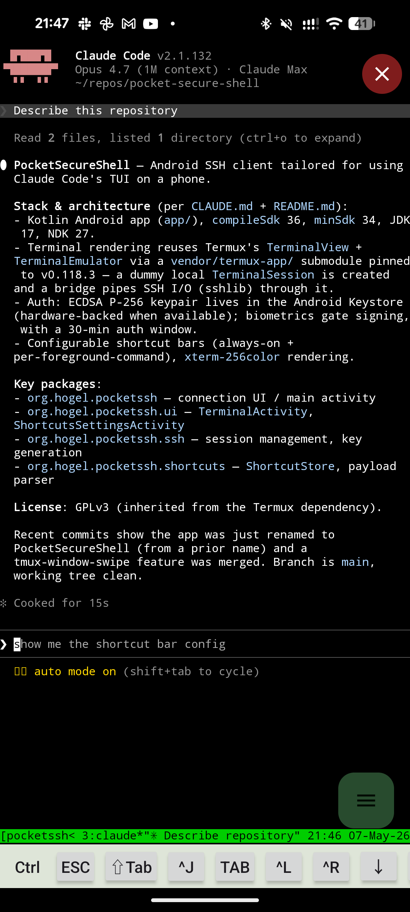

#  PocketSecureShell

Android SSH client tuned for terminal-heavy workflows like Claude Code's TUI.



Requires Android 14 (API 34) or later.

## Features

- Biometric-gated SSH public key authentication via [sshlib](https://github.com/connectbot/sshlib); one unlock authorizes signing for 30 minutes (the lock-screen unlock counts)
- Private key stays on the device and cannot be exported
- xterm-256color terminal emulation via [Termux terminal-emulator/terminal-view](https://github.com/termux/termux-app)
- tmux-aware: input surfaces switch with the active pane's foreground command
- Customizable per-context input surfaces: shortcut bar, left/right swipe payloads, and a FAB speed-dial menu
- Learned input suggestions per command, based on your past input
- Image upload: pick an image to upload to the remote and insert the path at the cursor — built for handing images to Claude Code
- Japanese IME input
- Crash reporting that filters out SSH credentials, hostnames, and terminal contents (see [Privacy Policy](docs/privacy.md))

## Install

- **Google Play (closed test)**: join the [`pocket-secure-shell-tester` Google Group](https://groups.google.com/g/pocket-secure-shell-tester), then open the [opt-in URL](https://play.google.com/apps/testing/org.hogel.pocketssh) and tap "Become a tester".
- **GitHub Releases**: grab the APK from [Releases](https://github.com/hogelog/pocket-secure-shell/releases). Recommended if you want to verify the binary against this source — see [Verifying release binaries](#verifying-release-binaries).

## Verifying release binaries

Release artifacts are built on GitHub Actions and signed with SLSA build
provenance. To verify that an APK or AAB came from this repository's release
workflow:

```bash
gh attestation verify pocketsecureshell-vX.Y.Z.apk --repo hogelog/pocket-secure-shell
```

## Build

### Requirements

- JDK 17
- Android SDK with `compileSdk` 36 (`minSdk` 34, `targetSdk` 36)
- Android NDK 27.0.12077973

### Steps

```bash
git submodule update --init --recursive
./gradlew assembleDebug
```

The debug APK will be produced at `app/build/outputs/apk/debug/app-debug.apk`.

## License

GPLv3 - See [LICENSE](LICENSE)
